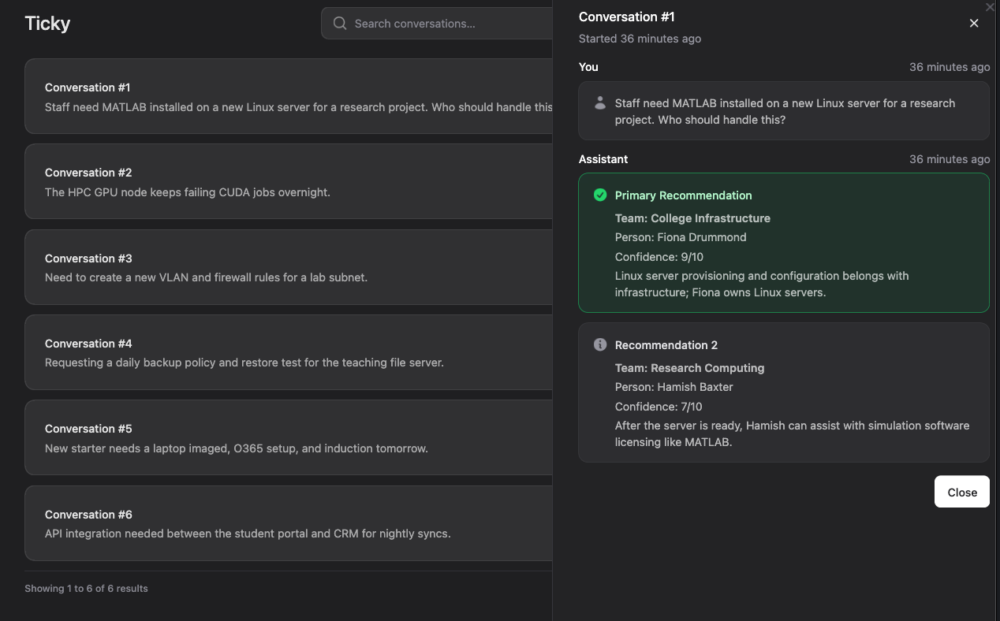

# Ticky

Ticky is a proof-of-concept application that helps IT support staff route tickets to the right team or person. Instead of manually triaging incoming requests, support staff can describe a ticket and get AI-powered recommendations based on the organisation's structure and team skills.

The app uses an org chart configuration (teams, members, and their skills) combined with a triage prompt to query a large language model. The LLM returns routing recommendations with confidence scores and reasoning, helping support staff make informed decisions about who should handle each ticket.



## Features

- Submit support tickets for AI-powered routing analysis
- Recommendations include team, person, confidence level, and reasoning
- Conversation history with search/filter capabilities
- Paginated dashboard showing previous triage sessions
- Flyout modal to view full conversation details
- Configurable org chart with teams and member skills
- Provider-agnostic LLM integration via Prism

## Tech Stack

- **Laravel 12** - PHP framework
- **Livewire 3** - Dynamic interfaces
- **Flux UI Pro** - Component library (Tailwind CSS + Vite)
- **Prism** - Provider-agnostic LLM integration
- **Lando** - Local development environment

## Getting Started

### Prerequisites

- [Lando](https://lando.dev/) installed on your machine
- Git
- An API key for your chosen LLM provider (OpenAI or Anthropic)

### Installation

1. Clone the repository:
```bash
git clone git@github.com:ohnotnow/ticky.git
cd ticky
```

2. Set up environment and dependencies:
```bash
cp .env.example .env
composer install
npm install
npm run build
```

3. Configure your LLM provider in `.env`:
```
OPENAI_API_KEY=your-key-here
# or
ANTHROPIC_API_KEY=your-key-here
LLM_MODEL=openai/gpt-4  # or anthropic/claude-3-sonnet
```

4. Start Lando and set up the database:
```bash
lando start
# If this is your first run, lando start may error due to missing DB tables
lando mfs  # Migrate and seed the database
```

5. Access the application at the URL shown by `lando info` (typically https://ticky.lndo.site)

### Default Login

- **Username:** admin2x
- **Password:** secret

### Development

- **Start Lando**: `lando start`
- **Migrate and Seed database**: `lando mfs`
- **Install dependencies**: `lando composer install` / `lando npm install`
- **Build assets**: `lando npm run build`
- **Run tests**: `lando artisan test`

### Common Lando Commands

- `lando artisan [command]` - Run Laravel artisan commands
- `lando composer [command]` - Run Composer commands
- `lando npm [command]` - Run npm commands
- `lando mysql` - Access MySQL shell
- `lando mfs` - Custom command to migrate fresh and seed (uses `TestDataSeeder`)

## Project Structure

- `app/Livewire/` - Livewire components (HomePage, TriageChat)
- `app/Models/` - Eloquent models (User, Conversation, Message)
- `app/Services/` - LLM service integration
- `config/ticky.php` - Org chart configuration and LLM settings
- `resources/views/livewire/` - Component views
- `resources/views/prompts/` - LLM prompt templates
- `resources/views/partials/` - Shared view partials

## API

Ticky provides a REST API for programmatic access, protected by Laravel Sanctum tokens.

### Managing API Tokens

Navigate to **API Keys** in the sidebar to create and revoke tokens. Admin users can view and manage all tokens; regular users see only their own.

### Endpoints

#### Submit Tickets for Triage

```bash
curl -X POST https://ticky.lndo.site/api/v1/triage \
  -H "Authorization: Bearer YOUR_API_TOKEN" \
  -H "Content-Type: application/json" \
  -H "Accept: application/json" \
  -d '{"tickets": ["Printer is jammed", "VPN is down"]}'
```

**Response:**
```json
{
  "data": [
    {
      "conversation_id": 456,
      "ticket": "Printer is jammed",
      "recommendations": [
        {
          "team": "Service Desk",
          "person": "Alex Smith",
          "confidence": 9,
          "reasoning": "Handles print issues"
        }
      ],
      "raw_response": "{\"recommendations\":[...]}"
    },
    {
      "conversation_id": 457,
      "ticket": "VPN is down",
      "recommendations": [],
      "raw_response": "Assistant text if no recommendations found"
    }
  ]
}
```

Each ticket creates a new conversation with isolated LLM context. The `recommendations` array contains parsed suggestions; `raw_response` always contains the full LLM output.

#### List Conversations

```bash
curl https://ticky.lndo.site/api/v1/conversations \
  -H "Authorization: Bearer YOUR_API_TOKEN" \
  -H "Accept: application/json"
```

**Response:**
```json
{
  "data": [
    {
      "id": 123,
      "created_at": "2024-02-01T12:34:56Z",
      "messages": [
        {
          "from": "user",
          "content": "Ticket text",
          "raw_response": null,
          "recommendations": [],
          "created_at": "2024-02-01T12:34:56Z"
        },
        {
          "from": "assistant",
          "content": null,
          "raw_response": "{\"recommendations\":[...]}",
          "recommendations": [
            {
              "team": "Service Desk",
              "person": "Alex Smith",
              "confidence": 9,
              "reasoning": "Handles print issues"
            }
          ],
          "created_at": "2024-02-01T12:35:10Z"
        }
      ]
    }
  ]
}
```

Returns only the authenticated user's conversations. User messages have `content`; assistant messages have `raw_response` and parsed `recommendations`.

## Configuration

The org chart and LLM settings live in `config/ticky.php`. You can customise:

- Team names and descriptions
- Team members and their skills
- LLM model selection
- Token limits

## License

This project is licensed under the MIT License.
